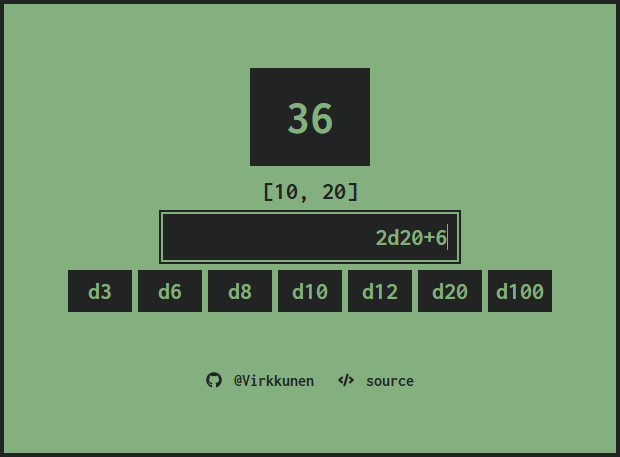

# Dice

A simple dice roller made with React


## Features

- Preset rolls of 7 dice `(d3, d6, d8, d10, d12, d20, d100)`
- Input field to roll a custom number of dice with custom face values `(200d17)`
- Supports dice notation `(5d6, 2d20+10, d12-4)`
- Mobile responsive


## Screenshots




## Demo

[Dice](https://vrkknn.net/dice)


## Run Locally

Clone the project

```bash
  git clone https://github.com/Virkkunen/dice.git
```

Go to the project directory

```bash
  cd dice
```

Install dependencies

```bash
  npm install
```

Start the server

```bash
  npm start
```


## Authors

- [@Virkkunen](https://www.github.com/Virkkunen)


## Tech Stack

React, React hooks, homebrewed CSS styles


## To Do
- [x] Use useMemo and useCallback for optimizations
- [ ] Show operator and modifier on rolls
- [ ] Animation while rolling the dice
- [ ] Multiple different dice rolling (2d20+2 + d3)
